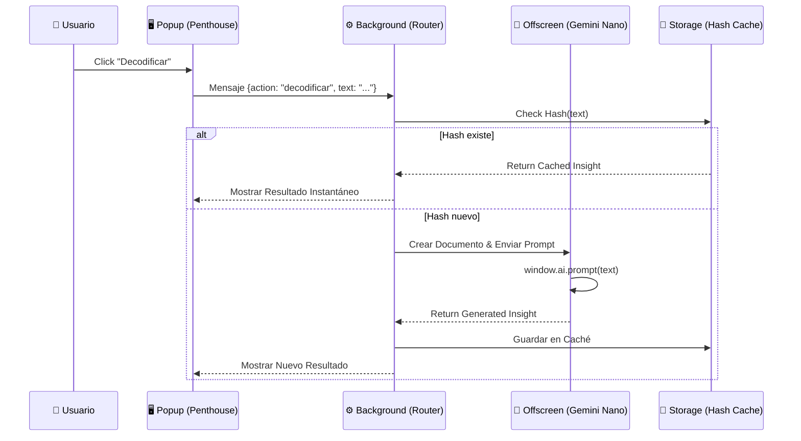

# 🦎 Insightify Chalamandra Pro v4.5.1
**"Caos transformado en Claridad. Soberanía Cognitiva 100% Local."**

## 🛡️ La Tesis del Proyecto
En un 2026 saturado de ruido algorítmico y manipulación emocional, **Insightify Pro** actúa como un búnker digital. Es una extensión de navegador diseñada bajo el framework **SRAP** para decodificar la web en tiempo real, utilizando inteligencia artificial puramente local. 

**Tus datos nunca abandonan tu máquina. Tu atención es solo tuya.**

---

## 💎 Pilares de Poder (Features)

### 1. Firewall de Integridad & Silent Scan
El sistema vigila en segundo plano. Mediante un escaneo silencioso, detecta patrones de *clickbait* y basura cognitiva. Si una web es marcada como riesgo, la **Blacklist Sincronizada** bloquea el acceso en todos tus dispositivos.

### 2. Memoria Holográfica por Hash
No desperdiciamos CPU. El sistema genera una **Huella Digital (SHA-256)** del contenido. Si ya has decodificado esa información (aunque esté en otra URL), la recuperación es instantánea desde la caché local.

### 3. Identicons Mandálicos & Resonancia
Cada sitio tiene una firma visual única generada matemáticamente. Al activar los **Audio Beats**, el Identicon vibra en sincronía con la IA, creando una experiencia multicanal de absorción de conocimiento.

### 4. IA 100% Local (Gemini Nano)
Implementación nativa del **Chrome Prompt API**. El procesamiento ocurre en un **Offscreen Document** aislado, garantizando que ninguna clave API ni dato viaje a la nube.

---

## ⚙️ Nueva Arquitectura: The Local Cortex Bridge

Debido a las restricciones de seguridad de Manifest V3, el núcleo de IA ha sido desacoplado:

1.  **Sentinel (Content):** Extrae el ADN del sitio (Texto/Meta).
2.  **Background (Service Worker):** Actúa como Router. Recibe la petición, verifica la caché (Hash Engine) y, si es nuevo, invoca al Cortex.
3.  **Offscreen Cortex (AI Sandbox):** Un documento invisible que tiene acceso al `window.ai`. Aquí vive Gemini Nano. Recibe el texto, lo procesa y devuelve el Insight.

### 📊 Diagrama de Flujo de Datos (Zero-Egress)

---

## 🚀 Instalación para el Top 1%

### Requisitos Críticos
Para que el **Cortex Local** funcione, necesitas Chrome (Canary/Dev recomendado) con:
1.  **Hardware:** GPU discreta o NPU integrada.
2.  **Flags Activados (`chrome://flags`):**
    *   `Enables optimization guide on device`: **Enabled BypassPerfRequirement**
    *   `Prompt API for Gemini Nano`: **Enabled**
    *   `Enables on-device text safety`: **Enabled** (Opcional pero recomendado)

### Despliegue Manual
1.  Descarga el archivo `chalamandra-pro.zip` de la última release.
2.  Ve a `chrome://extensions/` > Activa **Developer Mode**.
3.  Arrastra el .zip o selecciona "Load Unpacked" sobre la carpeta descomprimida.
4.  Espera a que Chrome descargue el modelo (puede tardar unos minutos la primera vez).

---

## 🔮 Roadmap v5.0
*   **Neural Sync:** Sincronización P2P de Blacklists entre usuarios de confianza.
*   **Vision Core:** Análisis de imágenes locales con Gemini Nano Multimodal.

---
*Hecho con 🦎 y cafeína por Chalamandra Labs.*
